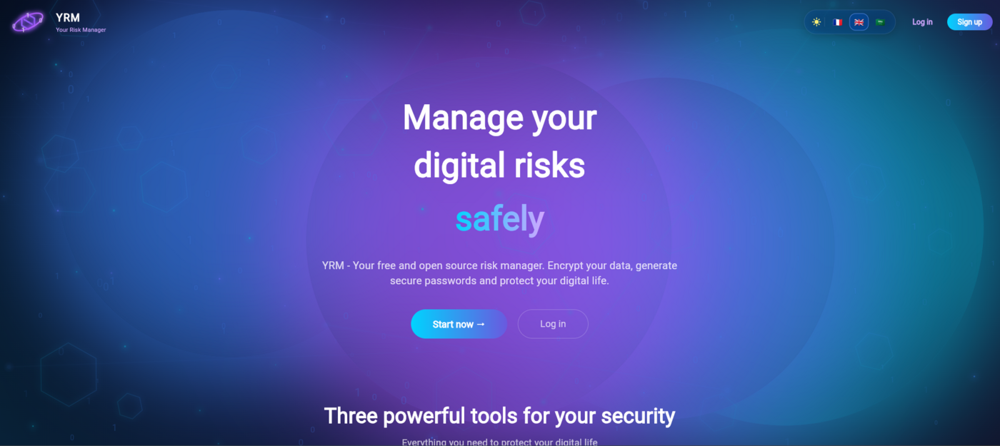
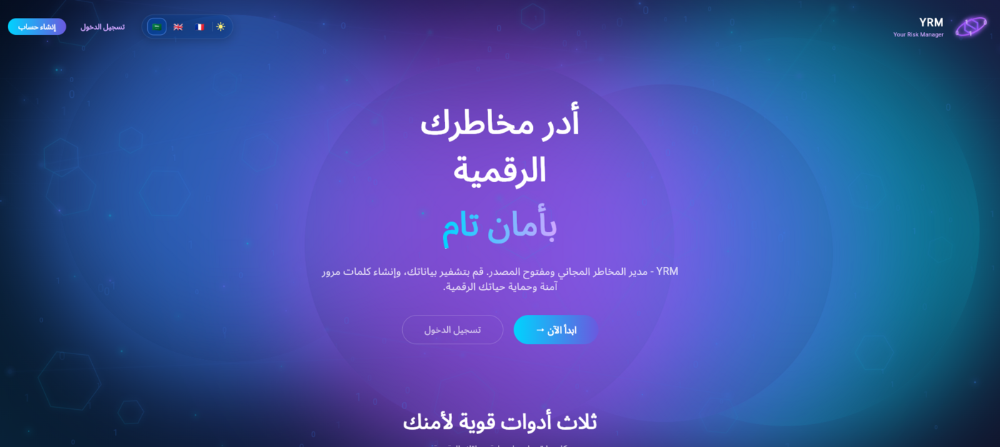
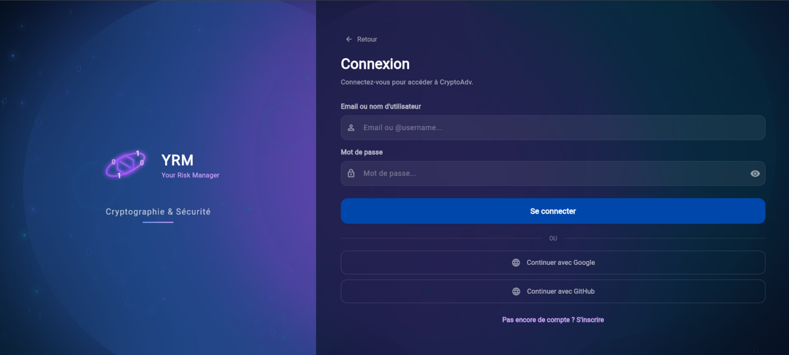
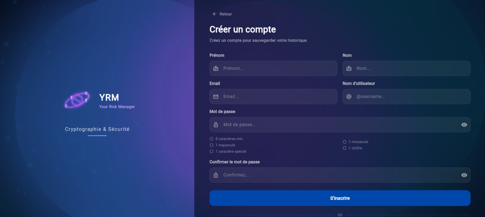
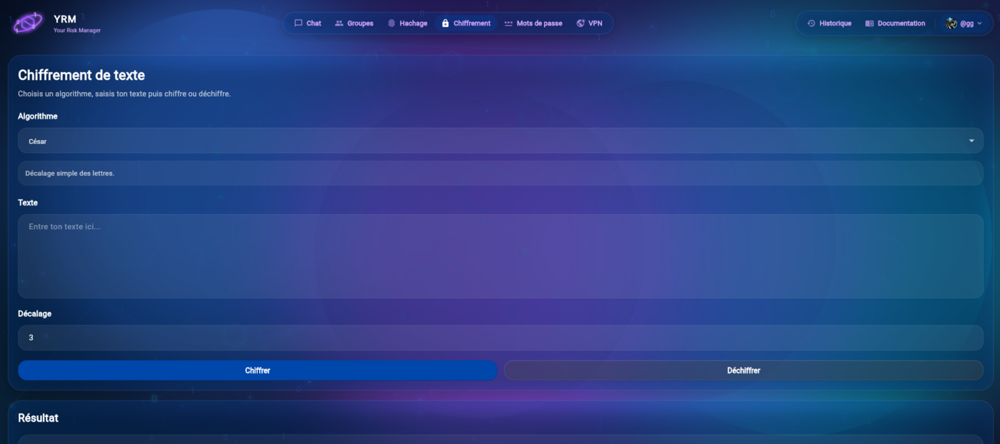
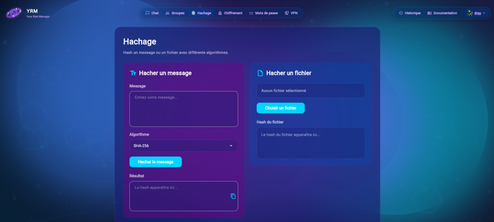
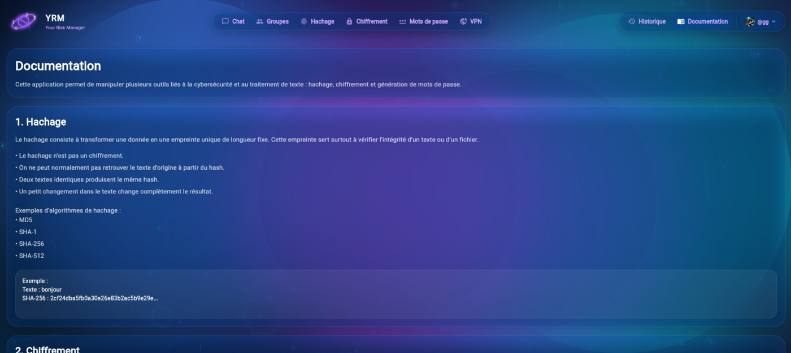
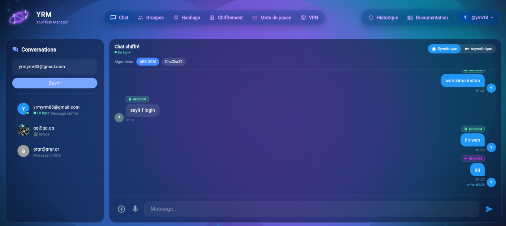
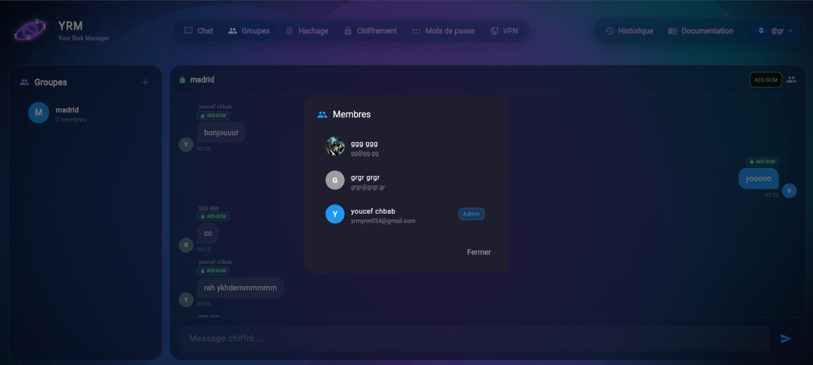
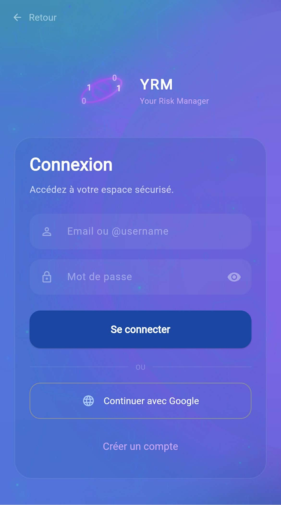

<div align="center">

# YRM — Your Risk Manager

**A free, open-source cryptography and security toolkit.**
Encrypt your data, hash files, manage passwords and chat end-to-end encrypted — on mobile, desktop and web.

Built with Flutter · Node.js · PostgreSQL

</div>

---

## Overview

YRM (internally `cryptoadv`) brings classical and modern cryptography together in one responsive app: Caesar and Vigenère ciphers, AES-GCM and ChaCha20-Poly1305 authenticated encryption, a full range of hash functions, a password analyser and generator, an encrypted real-time chat with groups and voice messages, and an RSA/PKI module with certificates, digital signatures and revocation checks — all documented in-app and available in English, French and Arabic.

---

## Features

- **Text encryption** — Caesar, Vigenère, AES-GCM and ChaCha20-Poly1305, with encrypt/decrypt in one screen.
- **Hashing** — MD5, SHA-1, SHA-224, SHA-256, SHA-384 and SHA-512, for text **and** files.
- **Password manager** — strength scoring against 8 criteria, configurable generator (length, cases, digits, symbols) and an encrypted local vault.
- **Encrypted chat** — real-time one-to-one messaging over WebSocket with a symmetric (AES-GCM / ChaCha20) or asymmetric (RSA + AES) mode, per-message algorithm badges, read receipts, presence, images and voice messages.
- **Groups** — encrypted group conversations with member management and admin roles.
- **PKI / VPN module** — RSA-OAEP key generation, certificates, digital signatures, signature and certificate verification, revocation checks.
- **History** — every crypto operation is logged locally and can be reviewed later.
- **Accounts** — email/username sign-up and login, JWT sessions, Google and GitHub sign-in.
- **Responsive** — dedicated mobile and desktop layouts for every screen, light and dark themes.
- **Multilingual** — English, French and Arabic with full RTL support.
- **In-app documentation** — each algorithm explained with examples.

---

## Screenshots

### Landing page

| French | English | Arabic (RTL) |
| :----: | :-----: | :----------: |
|  |  |  |

### Authentication

| Log in | Sign up |
| :----: | :-----: |
|  |  |

### Crypto tools

| Text encryption | Hashing |
| :-------------: | :-----: |
|  |  |

| Password manager | Documentation |
| :--------------: | :-----------: |
|  |  |

### Messaging

| Encrypted chat | Groups |
| :------------: | :----: |
|  |  |

### Mobile

| Log in | Conversations | Chat |
| :----: | :-----------: | :--: |
|  |  |  |

---

## Tech Stack

**Frontend**

- Flutter (Dart SDK `>=3.10.7`, Flutter `>=3.38.4`)
- `provider` — state management
- `hive` / `hive_flutter` — local database (mobile, desktop, web/IndexedDB)
- `cryptography`, `pointycastle`, `crypto` — AES-GCM, ChaCha20-Poly1305, RSA, hashing
- `web_socket_channel`, `http` — backend communication
- `record`, `audioplayers` — voice messages
- `shared_preferences`, `file_picker`, `path_provider`, `url_launcher`

**Backend** (`/server`)

- Node.js + Express
- WebSocket (`ws`) for real-time messaging
- PostgreSQL (`pg`)
- JWT authentication (`jsonwebtoken`) and `bcrypt` password hashing

**Platforms** — Android, iOS, Web, Windows, macOS, Linux.

---

## Installation

### Prerequisites

- [Flutter SDK](https://docs.flutter.dev/get-started/install) 3.38.4 or newer
- Node.js 18+ and npm
- PostgreSQL 14+

### 1. Clone the repository

```bash
git clone https://github.com/<your-username>/cryptoadv.git
cd cryptoadv
```

### 2. Set up the backend

```bash
cd server
npm install
cp .env.example .env
```

Edit `.env` with your own values:

```env
PORT=3000
JWT_SECRET=a_long_random_string
JWT_EXPIRES=30d

DB_HOST=localhost
DB_PORT=5432
DB_NAME=cryptoadv
DB_USER=cryptoadv_user
DB_PASSWORD=your_password
```

Create the database and run the migration:

```bash
createdb cryptoadv
psql -d cryptoadv -f migrate.sql
```

Start the server:

```bash
npm run dev     # development (nodemon)
npm start       # production
```

### 3. Set up the Flutter app

```bash
cd ..
flutter pub get
```

Point the app at your backend in `lib/core/config/api_config.dart`:

```dart
class ApiConfig {
  static const String host    = 'localhost';
  static const int    port    = 3000;
  static const String baseUrl = 'http://$host:$port';
  static const String wsUrl   = 'ws://$host:$port/ws';
}
```

---

## Usage

Run the app on your target platform:

```bash
flutter run                 # first connected device
flutter run -d chrome       # web
flutter run -d windows      # Windows desktop
```

Build a release:

```bash
flutter build apk --release        # Android
flutter build web --release        # Web
flutter build windows --release    # Windows
```

The web build is served directly by the backend — copy the output into `server/public`:

```bash
flutter build web --release
cp -r build/web/* server/public/
```

Run the tests:

```bash
flutter test
```

---

## Project Structure

```
lib/
├── backend/
│   ├── crypto/       # Caesar, Vigenère, hashing, password tools, AES/ChaCha20
│   └── security/     # RSA, PKI, key generation & management
├── core/             # config, database, localization, utils
├── models/           # data models
├── providers/        # state management
├── repositories/     # data access
├── services/         # auth, chat, network, socket, VPN, groups
├── views/            # screens (mobile + desktop variants)
└── widgets/          # reusable UI components

server/
├── routes/           # auth, users, messages, groups
├── middleware/       # JWT auth
├── public/           # Flutter web build served by Express
├── db.js
└── migrate.sql

docs/screenshots/     # images used in this README
```

---

## License

Add your license of choice here (e.g. MIT).
